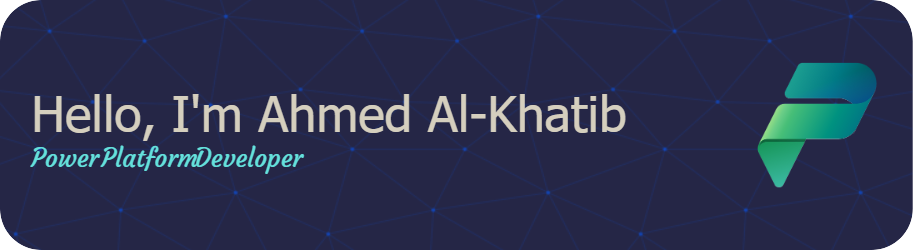

# This is Ahmed Al-Khatib, or you can call me Khatibz 😄
please find me in the social links below 😅

Hello 👋

## Want to know about me ? 👦

An enthusiastic developer who is consistently looking for new challenges.Passionate about problem solving and delivering innovative technology solutions that creates values for people and organizations. Also, enthusiast to learn state-of-art technologies.

I am interested in the following areas 

- [x] ⚙️ Power Platforms (Power Apps, Power Automate, ...) 
- [x] 🔄 Pipelining using Github Actions
- [x] ☁️ Deploying projects to cloud provider (AWS Azure)
- [X] 🛠️ Maintenance of software projects
- [x] 📦 Containerize application using Docker
- [x] :octocat: Manage projects via Git

## 🐙 Skills

Programing Skills

 

Soft Skills

 
  

<!---

## 📌 Top Repositories
 

 

-->

## 📈 My GitHub Stats

